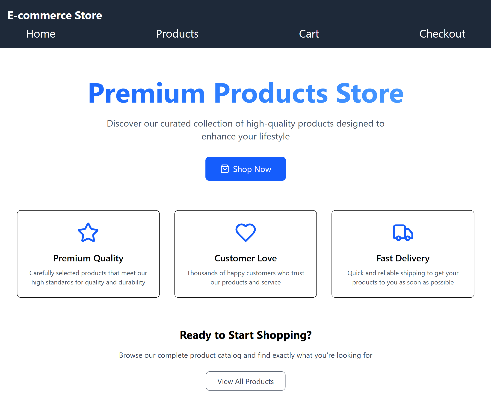
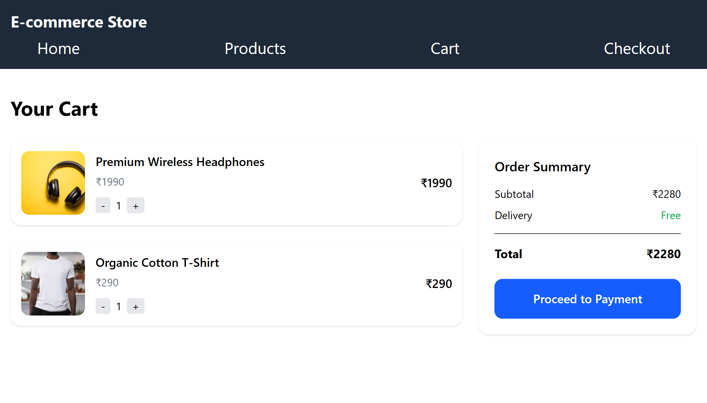
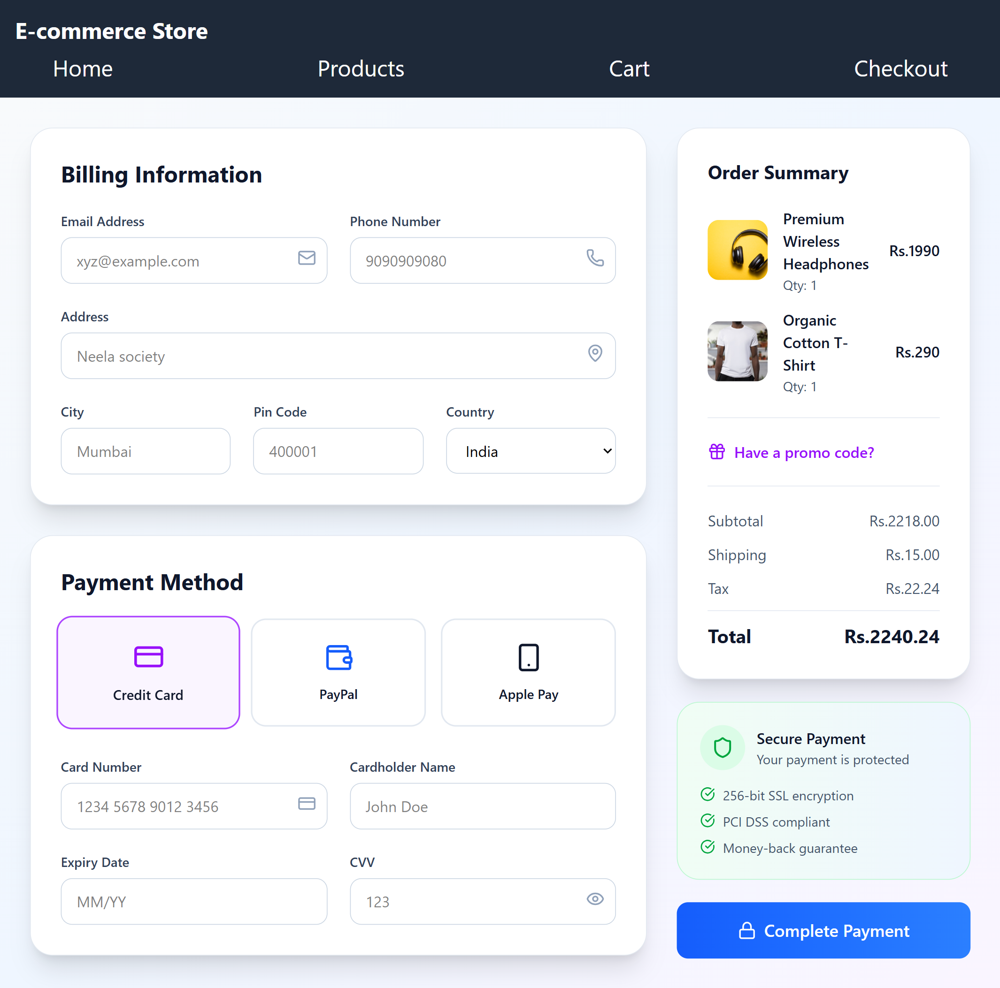
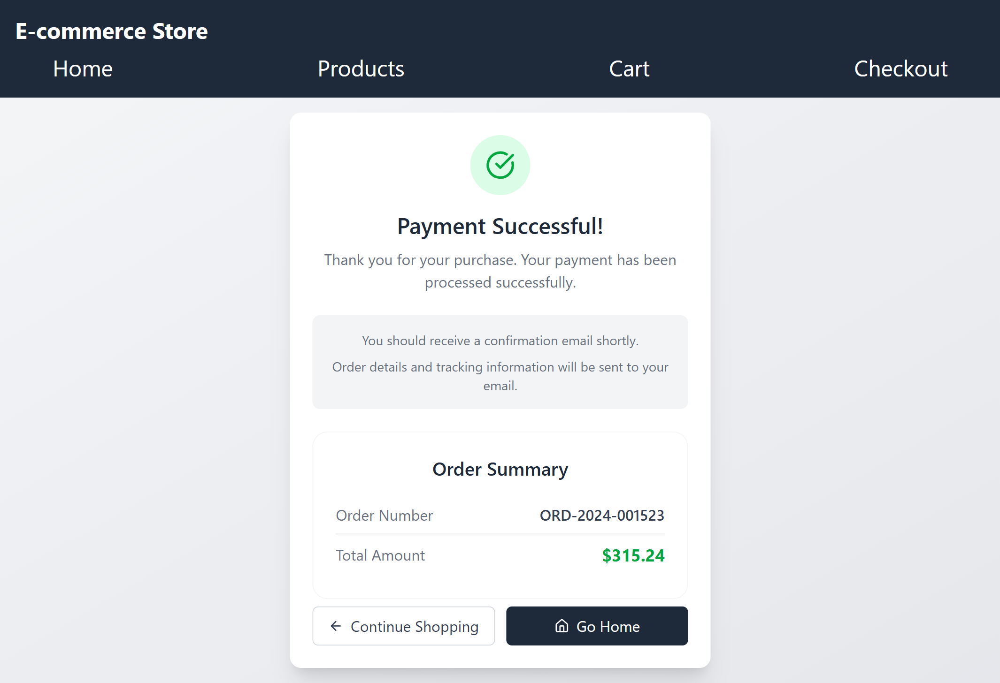
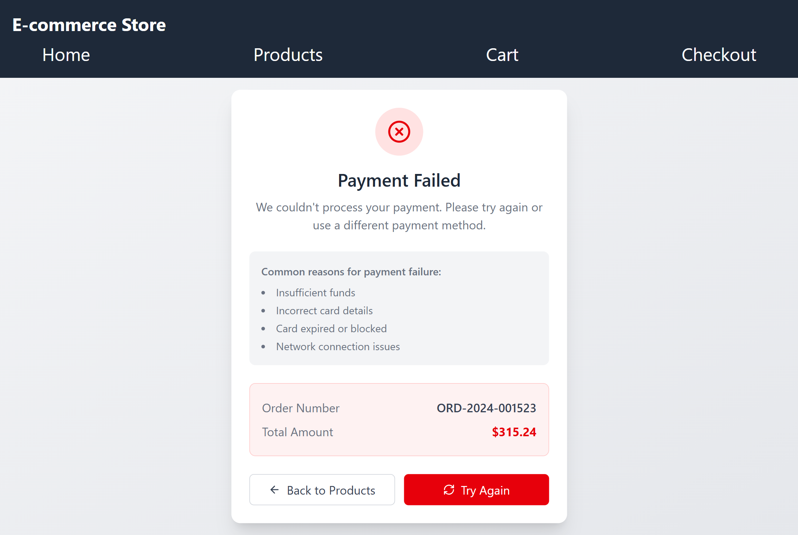

# E-commerce React App

## Project Overview

This is a simple e-commerce web application built with React and Vite. Users can browse products, add them to a cart, and simulate a checkout/payment process. The app demonstrates routing, state management, and basic UI/UX for an online store.

## Features

- Product listing with images, prices, and ratings
- Add to cart functionality
- Cart summary and order total calculation
- Checkout and payment simulation with success/failure redirection
- Responsive design with Tailwind CSS

## Setup Instructions

1. **Clone the repository:**
   ```bash
   git clone https://github.com/your-username/your-repo.git
   cd your-repo
   ```

2. **Install dependencies:**
   ```bash
   npm install
   ```

3. **Start the development server:**
   ```bash
   npm run dev
   ```

4. **Open in browser:**
   Visit [http://localhost:5173](http://localhost:5173) to view the app.

## Screenshots

### Home Page


### Product Listing


### Cart Page


### Checkout Simulation


### Payment Success


### Payment Failure


## Redirection & Payment Simulation

- When users click **Proceed to Payment** on the cart page, they are redirected to the `/checkout` route.
- On the checkout page, users can simulate a payment. Upon "payment," the app randomly redirects to either a **Success** or **Failure** page.
- This simulates a real-world payment gateway experience, allowing users to see both successful and failed payment flows.

---

Feel free to customize this README with your own
